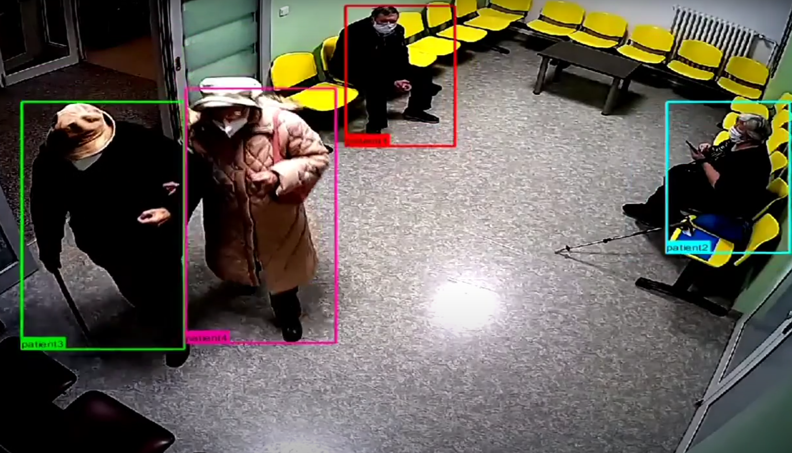

### Conferences and Presentations
- [**DexGANGrasp: Dexterous Generative Adversarial Grasping Synthesis for Task-Oriented Manipulation**](https://david-s-martinez.github.io/DexGANGrasp.io/)  
  *IEEE/RAS Humanoids 2024*

  

- [**Automatic Workspace Calibration Using Homography for Pick & Place**](https://www.researchgate.net/publication/374284646_Automatic_Workspace_Calibration_Using_Homography_for_Pick_and_Place)  
  *IEEE CASE 2023*

- [**Control System of Lower-Extremity Exoskeleton Based on ANN**](https://www.researchgate.net/publication/346463112_Control_System_of_a_Lower-Extremity_Exoskeleton_Based_on_Artificial_Neural_Networks)  
  *pHealth 2020*

- **Universal Robotic Cell Demos and Presentations**

  - [*Researchers Night 2022*](https://ricaip.eu/events/researchers-night-2022/)
  - [*US-EU Workshop on Intelligent Manufacturing 2022*](https://ricaip.eu/events/us-eu-workshop-on-intelligent-manufacturing/)
  - [*WODES 2022*](https://wodes2022.ciirc.cvut.cz/)
  - [*RICAIP Days 2022*](https://ricaip.eu/ricaip-days-2022/)
  - [*Researchers Night 2021*](https://x.com/RICAIP_EU/status/1441492384638984194)
  
  

  

- **5G Edge Vision System Demos and Presentations**
  - [*Brno International Engineering Fair 2022*](https://ricaip.eu/events/brno-msv-2022/)
  - [*German Vice Chancellor, Robert Habeck Official Visit*](https://ricaip.eu/german-vice-chancellor-habeck-visit/)
  - [*ŠKODA AUTO Official Visit*](https://ricaip.eu/skoda-auto-visit-august22/)
  - [*Executive Vice-President of European Commission, Frans Timmermans Official Visit*](https://ricaip.eu/timmermans-visited-ricaip/)
  - [*German President, Frank-Walter Steinmeier Official Visit*](https://ricaip.eu/german-president-in-ricaip/)

   

   

   

- [**Talk: AI and Exoskeletons (Spanish) - Robotic Minds 2021**](https://www.facebook.com/roboticmindsecuador/posts/pfbid0BCDmhkLMNg1HFDQUSJAVgotyLnMWuXWe3wQmFL3bL77G9QAjgwZUbNdjm72v8fzXl)

   

### Awards
- **Winner** - [Porsche Engineering Autonomous Driving Contest](https://www.youtube.com/watch?v=wrHd0e-xkkw)  
  *Issued by Porsche Engineering · May 2022*
  
   

- **Finalist** - European Healthcare Hackathon 2021  
  *Issued by CEE Hacks · Jan 2021*  
  Developed a diabetic ulcer detection system prototype, **DiaVision**, using deep learning and computer vision techniques. It measures the temperature, size, area, and rotation of ulcers in real time and generates detailed reports.

   

- **Finalist** - Global Smart Health Hackathon Prague 2020  
  *Issued by CEE Hacks · Jan 2020*  
  Created a TensorFlow-based computer vision solution capable of detecting patients and doctors in an intensive care unit.

   

- **Finalist** - RobotCraft ROS Maze Solving Challenge 2019  
  *Issued by Ingeniarius and University of Coimbra · Jan 2019*
  
   

- **Special Purpose Scholarship Award**  
  *Faculty of Biomedical Engineering, CTU Prague · Jan 2019 - 2020*

- **Infomatrix World Finals 2017, Bucharest, Romania**   
  *Issued by Lumina Foundation · May 2017*
  - **Silver Medal** - Sumo Robotics 

  - **Bronze Medal** - Robotics Lego Line Follower

  - **Bronze Medal** - Software Development

   

- **Gold Medal** - Software Development, Infomatrix South America 2017  
  *Issued by SOLACYT · Jan 2017*  
  Developed "MedWeb", an Android app for managing health services and medical data, supporting Quito, Ecuador's health IT infrastructure. Implemented in Android Studio (Java) with SQLite, Google Maps, Gmail, and Skype APIs.

   

- **Honor Roll Member**  
  *Issued by Marie Clarac School*  
  Achieved the 4th highest GPA.