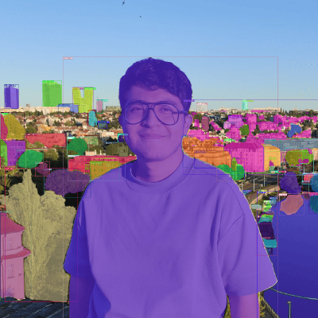

<!-- 1. **DexGANGrasp: Dexterous Generative Adversarial Grasping Synthesis for Task-Oriented Manipulation**  
   *Associated with Agile Robots SE*  
   DexGANGrasp is an AI model that uses conditional GANs (cGANs) to generate and evaluate robot grasps, achieving higher success rates than previous methods. By incorporating LLMs and VLMs through DexAfford-Prompt, it enables task-oriented grasping for complex, real-world scenarios.  
   - [Code](#)  
   - [Video](#)  
   - [Paper](#)  

2. **Universal Robotic Cell**  
   *Associated with RICAIP - Research and Innovation Centre on Advanced Industrial Production*  
   An industrial robotic cell powered by Deep Learning and 3D Computer Vision to detect, track, optimally grasp, and sort moving objects with complex geometries on a conveyor belt.  
   - [Code](#)  
   - [Video](#)  
   - [Paper](#)  

3. **5G Edge Vision System**  
   *Associated with RICAIP - Research and Innovation Centre on Advanced Industrial Production*  
   An artificial vision system based on CNNs and 3D pose estimation for a collaborative delta robot, using an internal campus 5G network and a GPU server. Sponsored by T-Mobile CZ (Deutsche Telekom) and Siemens.  
   - [Code](#)  
   - [Video](#)  
   - [Paper](#)  

4. **Luggage Carrying Task with the TIAGo Humanoid Robotic Platform**  
   *Associated with Technical University of Munich*  
   Integrated advanced robotic capabilities like perception, manipulation, navigation, and human-robot interaction using ROS. Achievements include autonomous detection and navigation to pick up luggage using CNNs, obstacle avoidance via SLAM, and operator following through Human-Robot Interaction.  
   - [Code](#)  
   - [Video](#)  
   - [Paper](#)  

5. **NAO U NO: Teaching the NAO Humanoid to Play UNO Using AI**  
   *Associated with Technical University of Munich*  
   The project aims to make the NAO Robot play the UNO card game. It uses ROS to integrate sensing, deep learning-based card detection, bipedal locomotion, and decision-making based on a State Machine Agent.  
   - [Code](#)  
   - [Video](#)  
   - [Paper](#)  

6. **Convolutional Neural Network Based Soft-Exoskeleton for Stroke Patient Rehabilitation**  
   *Associated with Technical University of Munich*  
   A soft robotic glove for stroke patients, incorporating a CNN-based vision system to recognize objects and automatically adjust the hand's opening for grasping.  
   - [Code](#)  
   - [Video](#)  
   - [Paper](#)  

7. **Design and Implementation of 2-DoF Upper-Limb Exoskeleton with Combined Force and Position Control for Rehabilitation**  
   *Associated with Technical University of Munich*  
   This exoskeleton assists arm and wrist movements with position and force control, using an "intention detection algorithm" to predict user motions. The system enhances natural movement through muscle activity analysis and motion tracking.  
   - [Code](#)  
   - [Video](#)  
   - [Paper](#)  

8. **Adversarial Multi-Agent Training Based on Deep Q-Learning Applied to the Snake Game**  
   *Associated with Technical University of Munich*  
   - [Code](#)  
   - [Video](#)  
   - [Paper](#)  

9. **Fabrication of Soft Milli, Micro, and Nano Robots Based on Alginate Polymer Coating and Encapsulation**  
   *Associated with Technical University of Munich*  
   - [Code](#)  
   - [Video](#)  
   - [Paper](#)  -->
  <!DOCTYPE html>
<html lang="en">
<head>
    <meta charset="UTF-8">
    <meta name="viewport" content="width=device-width, initial-scale=1.0">
    <title>Projects</title>
    
</head>
<body>

    
    

        <h3>DexGANGrasp: Dexterous Generative Adversarial Grasping Synthesis for Task-Oriented Manipulation</h3>
        
DexGanGrasp is an AI model that uses cGANs to generate and evaluate robot grasps, achieving higher success rates than previous methods. By incorporating LLMs and VLMs through DexAfford-Prompt, it enables task-oriented grasping for more complex, real-world scenarios.

        

            <a href="#">Code</a>
            <a href="#">Video</a>
            <a href="#">Article</a>
        

    

    
    

        <h3>Universal Robotic Cell</h3>
        
An industrial robotic cell powered by Deep Learning and 3D Computer Vision to detect, track, optimally grasp and sort moving objects with complex geometries on a conveyor belt.

        

            <a href="#">Code</a>
            <a href="#">Video</a>
            <a href="#">Article</a>
        

    

    
    

        <h3>5G Edge Vision System</h3>
        
An artificial vision system based on CNNs and 3D pose estimation for a collaborative delta robot using an internal campus 5G network and a GPU server. The project was sponsored by T-Mobile CZ (Deutsche Telekom) and Siemens.

        

            <a href="#">Code</a>
            <a href="#">Video</a>
            <a href="#">Article</a>
        

    

    
    

        <h3>Luggage Carrying Task with the TIAGo Humanoid Robotic Platform</h3>
        
Integration of advanced robotic capabilities such as perception, manipulation, navigation, and human-robot interaction using ROS. Key achievements include autonomous detection and navigation to pick up luggage (bag) based on CNNs, obstacle avoidance via SLAM, and following the operator to a designated location based on Human-Robot Interaction.

        

            <a href="#">Code</a>
            <a href="#">Video</a>
            <a href="#">Article</a>
        

    

    
    

        <h3>NAO U NO: Teaching the NAO Humanoid to Play UNO Using AI</h3>
        
The project aims to make the NAO Robot play the UNO card game. It uses ROS to integrate its different assets like sensing, deep learning based card detection, bipedal locomotion and decision-making based on a State Machine Agent.

        

            <a href="#">Code</a>
            <a href="#">Video</a>
            <a href="#">Article</a>
        

    

    
    

        <h3>Convolutional Neural Network Based Soft-Exoskeleton for Stroke Patient Rehabilitation</h3>
        
This paper presents a soft robotic glove for stroke patients that incorporates a CNN-based computer vision system. This neural network allows the glove to intelligently recognize objects and automatically adjust the hand's opening for grasping.

        

            <a href="#">Code</a>
            <a href="#">Video</a>
            <a href="#">Article</a>
        

    

    
    

        <h3>Design and implementation of 2-DoF upper-limb exoskeleton with combined force and position control for rehabilitation</h3>
        
The exoskeleton assists arm and wrist movements with both position and force control, and uses an "intention detection algorithm" to predict the user's desired motions. This allows for more natural and responsive assistance, which was evaluated by measuring muscle activity and tracking the accuracy of executed movements.

        

            <a href="#">Code</a>
            <a href="#">Video</a>
            <a href="#">Article</a>
        

    

    
    

        <h3>Adversarial Multi-Agent Training Based on Deep Q-Learning Applied to the Snake Game</h3>
        

            <a href="#">Code</a>
            <a href="#">Video</a>
            <a href="#">Article</a>
        

    

    
    

        <h3>Fabrication of Soft Milli, Micro and Nano Robots Based on Alginate Polymer Coating and Encapsulation</h3>
        

            <a href="#">Code</a>
            <a href="#">Video</a>
            <a href="#">Article</a>
        

    

</body>
</html>